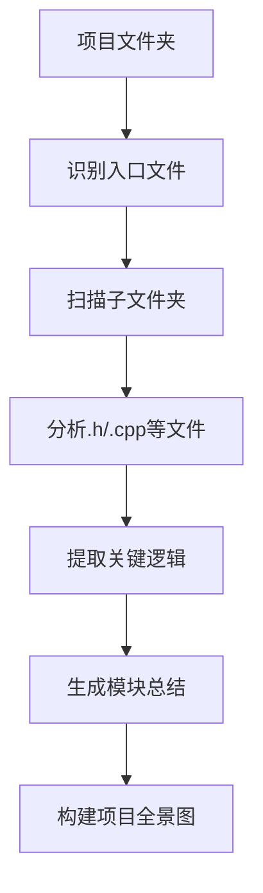

# QT程序：基于DeepSeek的大项目解析

## 🚀 项目概述
**无需安装目标语言环境**，即可实现跨语言项目解析与转换工具。基于DeepSeek模型，支持多语言代码分析（C++、Java、Python、Go等），自动提取模块逻辑，生成项目全景图，并提供对话式交互功能。

## 🎯 项目背景（解决痛点）
1. **环境配置复杂** - 只需安装QT环境，无需目标语言环境
2. **语言障碍** - 消除多语言语法差异带来的理解障碍
3. **跨语言转换困难** - 自动化代码翻译与转换
4. **提示词限制** - 支持动态添加分析规则
5. **上下文限制** - 支持处理大型项目文件（96-128KB）
6. **测试覆盖不足** - 自动生成全面测试用例建议
7. **模型稳定性** - 确保多次执行结果一致性
8. **大文件处理** - 支持32k Tokens上下文（约128KB代码）

## ✨ 核心功能

### 🔍 智能项目解析

### 📁 文件处理流程
1. **智能入口识别** - 优先定位`main`文件或入口文件
2. **多语言支持** - 支持C++(.h/.cpp)、Java(.java)、Python(.py)等
3. **关键字过滤** - 按需筛选关键文件进行分析
4. **层级化总结** - 文件级 → 模块级 → 项目级分析

### 💬 对话式交互
- 基于分析结果进行深度提问
- 生成测试用例建议
- 代码转换与优化建议
- 架构设计咨询

## 📊 技术优势

| 特性 | 说明 |
|------|------|
| **零目标环境依赖** | 无需安装Python/Go等语言环境 |
| **大文件处理** | 支持32k Tokens上下文 |
| **跨语言支持** | 多语言代码理解与转换 |
| **动态规则扩展** | 运行时添加分析规则 |
| **稳定输出** | 确保多次执行结果一致 |

## 🛠️ 使用方法
1. 指定项目根目录
2. 选择目标语言（可选）
3. 设置分析规则（可选）
4. 启动解析过程
5. 查看全景分析报告
6. 基于结果进行对话式提问

## 🌟 应用场景
- 遗留系统迁移（如C++转Go）
- 多语言项目维护
- 快速理解开源项目
- 自动化文档生成
- 代码质量审查

## 📦 部署要求
- Qt 6.7+ 环境
- Windows/Linux/macOS
- 8GB+ 内存（推荐16GB用于大项目）

---

**让大型项目分析变得简单高效 - 无需成为全栈专家，也能轻松驾驭多语言项目！**

